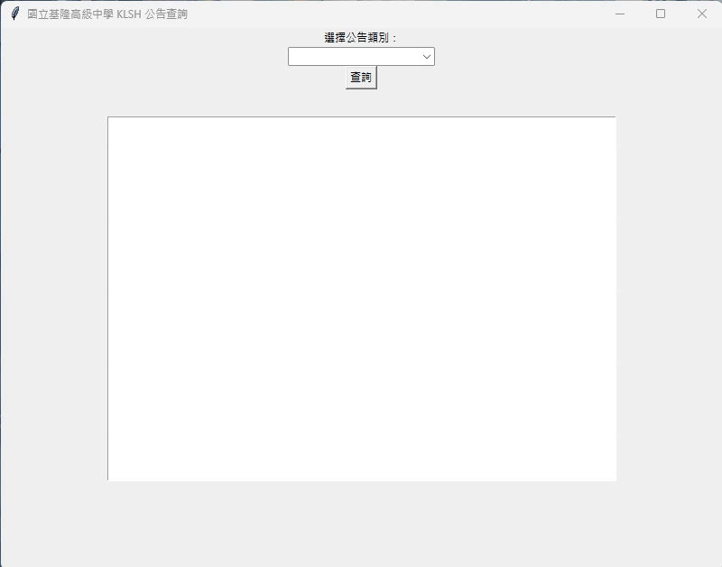

# 基隆高中公告查詢工具

這個程式是一個簡單的 GUI 工具，能夠協助你查詢國立基隆高級中學（KLSH）的置頂和重要公告。使用了 Tkinter 來建立用戶介面，並利用 urllib 和 Beautiful Soup 套件從網站上爬取公告內容，以清晰的方式呈現在程式視窗中。

## 功能簡介

- 查詢並顯示國立基隆高級中學的置頂和重要公告。
- 使用者可以選擇公告類別，查看對應的公告內容。
- 公告標題以藍色超連結方式呈現，點擊可以在瀏覽器中開啟公告連結。

## 注意事項
- 此程式僅提供查看置頂公告和重要公告內容，以符合大多數使用者的需求。
- 程式所顯示的內容僅為網頁上的部分內容，若有詳細內容或其他公告類別，請前往官方網站查詢更多資訊。

## 如何使用

1. 在終端機或命令提示字元中，執行程式檔案 `KLSH.py`。
2. 選擇你想查詢的公告類別（置頂或重要）。
3. 按下「查詢」按鈕，程式將從國立基隆高級中學網站獲取公告內容並顯示在視窗中。
4. 公告標題以藍色超連結呈現，點擊標題可以在瀏覽器中開啟公告連結。

## 範例演示



## 執行需求

- Python 3.x 版本
- Tkinter 庫
- NumPy 套件
- Beautiful Soup (bs4) 庫

## 安裝步驟

1. 使用 `git clone` 命令或下載 ZIP 壓縮檔，將程式複製到你的電腦中。

2. 在命令提示字元中，進入程式所在的資料夾。

3. 執行以下指令，安裝必要的套件：
    ```
    pip install thinker
    ```
    ```
    pip install urllib3
    ```
    ```
    pip install beautifulsoup4
    ```

4. 執行程式：
    ```
    python KLSH.py
    ```

## 授權訊息

這個程式遵循 [MIT 授權](LICENSE.txt)，您可以自由地使用、修改和分享這個程式。
